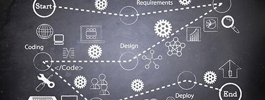

# Wearables E-Commerce Project

You will make use of _everything_ that you have learned thus far in the bootcamp to build an e-commerce app that will showcase all of the provided _wearables_ items.

The stack is React.Js, Redux, Node.Js, and styled-components.

Your node server should be RESTful and follow REST principles, at least to the extent we learned during the bootcamp.

## Getting Started

You have your assignment and your team. What should you do first? This will vary for every team, and even every team member.

**The important thing is to NOT just jump in and start coding!**

There probably shouldn't be any coding until very near the end of the first day.

### Planning

#### First team meeting

[Successful Software Project Delivery in 10 Steps](https://www.appnovation.com/blog/successful-software-project-delivery-10-steps).

💡 How a project starts is indicative of how it will end.

##### Kick-off Meeting

- **Housekeeping**
  - Begin by setting times for meetings over the next week.
    - These meetings, or _stand-ups_, should occur at least once a day. We do recommend twice a day, given the tight deadline.
    - They can last anywhere from 15 minutes to 1 hour. Expect meetings to be longer at the beginning of the project as everyone is still trying to understand what it is they have to do.
- **Understand**
  - what are we building?
  - what are the requirements?
  - Is the project clear?
  - Do we have questions for the stakeholders? _If so, book some time with a TC, or your instructor._
- **Brainstorming**
  - Take a look at the data
    - What do we have to show?
    - How ca nwe make the most of the provided data?
  - Ideas for store functionality
    - What do we want users to be able to do?
  - Look and feel
    - Any real-life e-comm sites that inspires us?
- **Division of labor**
  - Begin to break down the project into tasks, and then into subtasks, and maybe even subsubtasks. \_Breaking things down into the smallest task possible will improve the collaborative effort of each individual team member.
  - Move all tasks to a board of some kind. [Trello](https://trello.com) would be the easiest to figure out and use.
  - Assign tasks
    - This is much more open. Discuss with your team to figure out how best to proceed. If you are unsure, speak with a TC or your instructor.
    - Possible questions (relevance will depend on group size)...
      - Who is most excited about a particular task?
      - Do we need a manager for a particular group of tasks? i.e. BE, FE.
      - Who will coordinate between the BE and FE.

---

## Teamwork

The most important aspect of this project is the ability to work in a team. No matter your contribution to the project, yuo should understand the _full_ codebase. This will require that you

- **review** each other's code
- **ask** questions when you don't understand
- **comment** your code extensively. Always go for clarity over brevity.

## GitHub
