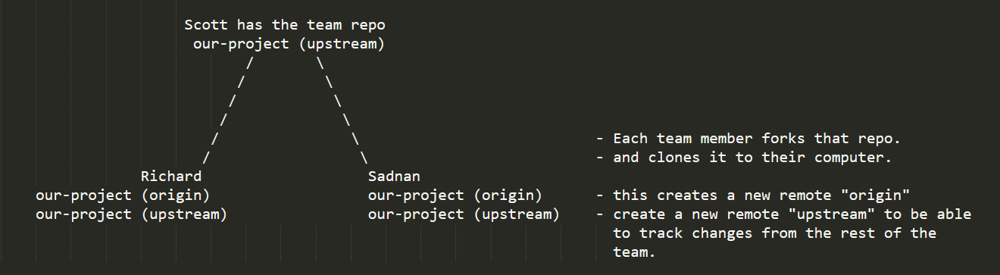

# GitHub

1. Decide which team member will have the `master` repository for your project, and will be the _team lead_.
2. That person's fork of this repository will be the one that everyone else in the team opens PRs on. _Your PM will get you set up with this and explain any questions you may have._
3. The _team lead_ will merge the PRs into the their repo.

Your work will be on `origin` and the team's collaboration happens on `upstream`.

### Individual worflow

1. `git stash`
2. `git pull upstream`
3. `git stash apply`
4. Check your files for any merges that needs to be done.
5. `git add .`
6. `git commit -m "your commit message"`
7. `git push origin HEAD`
8. Open a PR on "team lead" repo.

Once the lead merges the PR, the rest of the team can now pull your changes into their repos.

1. `git stash`
2. `git pull upstream`
3. `git stash apply`

If you happen to work in some of the same files as a teammate, you will probably have conflicts. Use the VS Code UI to navigate these and resolve them. _If you get into weird state and start to panic, see someone, say something._

https://www.neonscience.org/git-setup-remote
