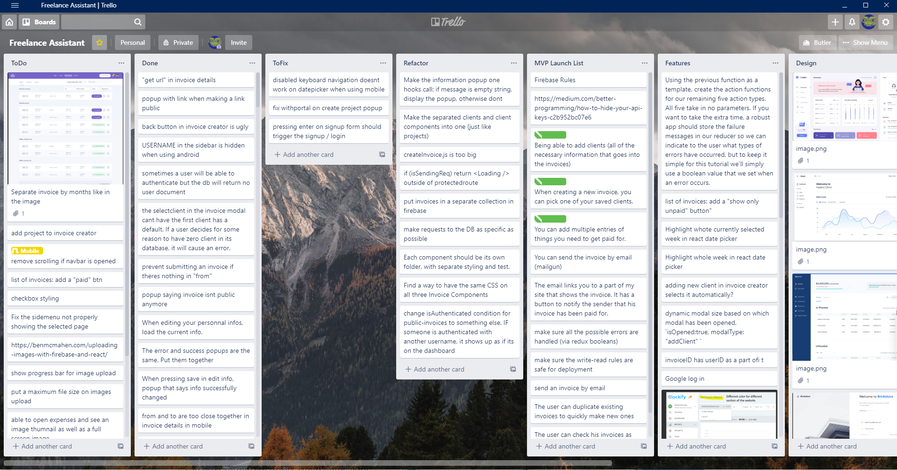

## General Guidelines

1. Do NOT work on the same files at the same time. If you have no other choice, be very careful not to be working on the same parts of that file because it can lead to merge issues and headaches.
2. Everybody should be relatively up to the date with the latest version of the project. A push/pull from everyone every 2hours is usually a good place to start.
3. Be careful when modifying somebody elses code.
4. I highly recommend you use a Trello board to keep track of the most important tracks and to make sure everybody is on the same page. [https://trello.com/](https://trello.com/)

Your trello board should have the following columns:

- ToDo: Put your most important tasks in order. You should assign each task to a member so that everyone knows what they should be doing.
- MVP (Minimal Viable Product): What are the core features of your app? If you were to cut out everything that is unnecessary, what would be left of it? These are what you should work on first.
- Features: Once you are done with your MVP, what are the features that would bring the most value to what you just built. You can put these in order and try to build as many of them before the deadline.
