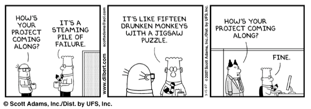

# Wearables E-Commerce Project

You have plenty of freedom in how the app will look and behave. As long as you meet the MVP requirements below, your poject will be deemed successful!

## MVP

### Frontend

Users should be able to

- view all items in the _database_.
- purchase items that are in stock.
- view a cart containing the items they intend to purchase.
- edit cart before completing the purchase.

### Backend Requirements

The Node server should

- be RESTful (use the right `method` for the right job)
- provide the FE with the required data in a succinct and organized way.
- update the inventory as users make purchases.

### Stretch Goals

In no particular order

- view the app on a variety of devices. _app should look decent an all screen sizes._ (FE)
- User can signin via [Google Auth](https://developers.google.com/identity/sign-in/web/sign-in), or [Autho0](https://auth0.com/) (BE, FE)
- User can search the store for item(s) based on various criteria (up to you) (BE, FE)

## About the Data

All about Wearables!
You will find 349 items in the `_data/items.json` file. The data is mostly clean, but there could be some irregularities, i.e. empty values, values that we really don't need. _This is common in large databases, and something that we have to deal with._

### Item Object

```js
  {
    "name": "Barska GB12166 Fitness Watch with Heart Rate Monitor",
    "price": "$49.99",
    "body_location": "Wrist",
    "category": "Fitness",
    "id": 6543,
    "imageSrc": "data:image/jpeg;base64,/9j/4AAQSkZJRgABAQAAAQABAAD/2wCEAAkGBwgHB...<REST_OF_IMAGE_ENCODING>",
    "numInStock": 9,
    "companyId": 19962
  },
```

### Company Object

```js
  {
    "name": "Barska",
    "url": "http://www.barska.com/",
    "country": "United States",
    "id": 19962
  }
```

## 🤣 Don't be this guy...


